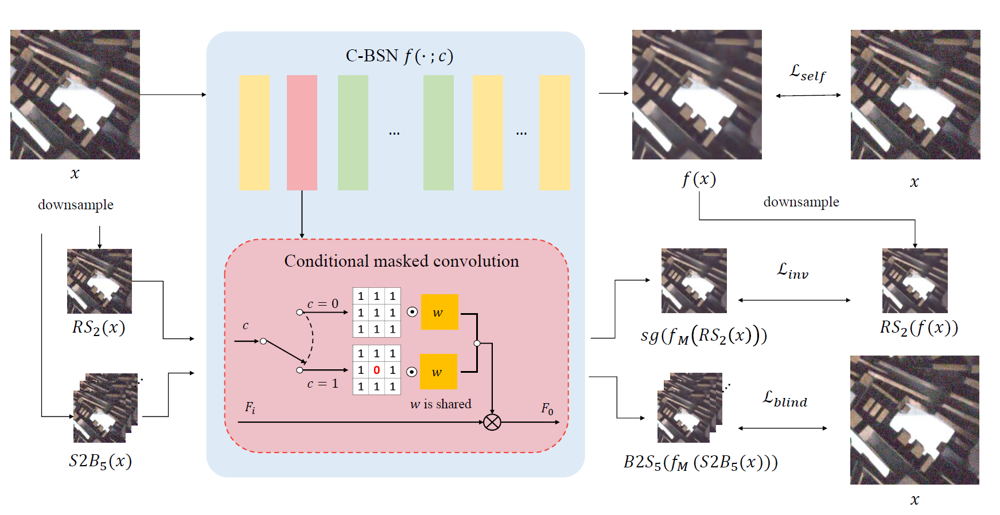

# Self-supervised Image Denoising with Downsampled Invariance Loss and Conditional Blind-Spot Network

Yeong Il Jang, Keuntek Lee, Gu Yong Park, Seyun Kim, Nam Ik Cho

[[Arxiv](https://arxiv.org/abs/2304.09507)]

---

## Abstract

There have been many image denoisers using deep neural networks, which outperform conventional model-based methods by large margins. Recently, self-supervised methods have attracted attention because constructing a large real-noise dataset for supervised training is an enormous burden. The most representative self-supervised denoisers are based on blind-spot networks, which exclude the receptive field’s center pixel. However, excluding any input pixel is abandoning some information, especially when the input pixel at the corresponding output position is excluded. In addition, a standard blind-spot network fails to reduce real camera noise due to the spatial correlation of noise, though it successfully removes independently distributed synthetic noise. Hence, to realize a more practical denoiser, we propose a novel self-supervised training framework that can remove real-world noise. For this, we derive the theoretic upper bound of a supervised loss where the network is guided by the downsampled blinded output. Also, we design a conditional blind-spot network (C-BSN), which selectively controls the blindness of the network to use the center pixel information. Furthermore, we exploit a random subsampler to decorrelate noise spatially, making the C-BSN free of visual artifacts that were often seen in downsample-based methods. Extensive experiments show that the proposed C-BSN achieves state-of-the-art performance on real-world noise datasets as a self-supervised denoiser and shows qualitatively pleasing results without any post-processing or refinement.

## overview

<p align="center"></p>

## Code


### Environment

-	Windows10 / Ubuntu 16.04 / Ubuntu 18.04
-	Tensorflow 1.15
-	Python 3.7

### Dataset

- Place noisy datasets in dataset folder.
  - [[Darmstadt Noise Dataset]](https://noise.visinf.tu-darmstadt.de/), [[SIDD-Medium Dataset/Validation Data and Ground Truth]](https://www.eecs.yorku.ca/~kamel/sidd/)

- Final dataset directories should be like 
```
dataset
├─ dnd2017
│  └─....
├─ SIDD_Medium_Srgb
│  └─....
├─ ValidationNoisyBlocksSrgb.mat
└─ ValidationGTBlocksSrgb.mat
```

- Run prepare_dataset.py to make tfrecords and validation npy .

[comment]: <> (- you can use custom images as training dataset by glob command for dataset argument)

### Training code
```
python train.py --gpu [GPU_ID] --name [Experiment Name] --dataset [SIDD or DND]

Arguments
    --gpu       GPU ID
    --name      Name of Experiment. Checkpoints and tfevents will be saved in ckpts/[name].
    --dataset   Training dataset(tfrecords) : SIDD or DND (default: SIDD)
    --patchsize Size of training patch. Must be dividable by stride_b and stride_i. (default: 120)
                Use 240 for better performance.
```


More details about optional arguments can be found with 
```
python train.py --help 
```


### Test code

```
python infer.py --gpu [GPU_ID] --modelpath [Checkpoint_path] --imagepath [Image_glob] --savepath [Output folder]
```

You can use the following sample command to test the denoiser with sample images.

```
python infer.py --gpu 0 --modelpath ./pretrained/CBSN_SIDDtrain.ckpt --imagepath ./Figures/sampleimage*.png --savepath ./results/
```

## Results

### SIDD/DND benchmark

<p align="center"></p>

### Visualized Comparison

<p align="center"></p>

Citation
--------

```
@inproceedings{jang2023cbsn,
  title={Self-supervised Image Denoising with Downsampled Invariance Loss and Conditional Blind-Spot Network}, 
  author={Jang, Yeong Il and Lee, Keuntek and Park, Gu Yong and Kim, Seyun and Cho, Nam Ik},
  booktitle={Proceedings of the IEEE/CVF International Conference on Computer Vision},
  year={2023}
}
```
